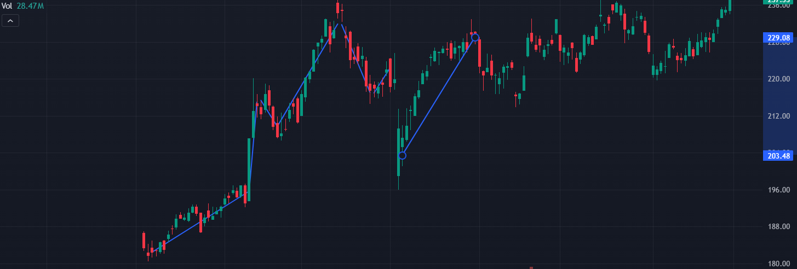

# 📈 **StockSage AI** 📉



Welcome to **StockSage AI**, your ultimate tool for predicting stock market trends using advanced machine learning techniques! 🚀 Whether you're a seasoned trader or just starting out, StockSage AI provides insightful predictions to help you make informed investment decisions. 💡


## 🔥 Features

- **Accurate Predictions**: Utilize Support Vector Regression (SVR) to forecast stock prices with impressive accuracy.
- **Interactive Charts**: Visualize your predictions with dynamic and easy-to-understand graphs.
- **Customizable Parameters**: Tailor your predictions by adjusting the number of prediction days, start and end dates, and more.
- **Data Export**: Save your prediction results and accuracy scores for future reference and analysis.
- **User-Friendly Interface**: Simple and intuitive setup to get you up and running in no time.

## 📊 How It Works

StockSage AI leverages historical stock data to train an SVR model, which then predicts future stock prices. By iteratively forecasting each day, it provides a comprehensive outlook on potential market movements. The accuracy of each prediction step is also recorded to ensure reliability.

## 🛠️ Getting Started

### Prerequisites

- Python 3.x
- Required Python libraries:
  - yfinance
  - pandas
  - numpy
  - scikit-learn
  - matplotlib

### Installation

1. **Clone the Repository**
   ```bash
   git clone https://github.com/Master-Bros-Developers/StockSage-AI.git
   ```
2. **Navigate to the Project Directory**
   ```bash
   cd StockSage-AI
   ```
3. **Install Dependencies**
   ```bash
   pip install -r requirements.txt
   ```

### Usage

Run the long-range prediction scripts using Python:

```bash
import analyzer as pt

pt.range_predict(ticker="AAPL", prediction_days=100, start_date="1996-01-01", plot_show=True, file=True, log=True)
```
You can customize it by changing the parameters:  
- `ticker`: The ticker of the stock you want to predict.  
- `prediction_days`: The number of days you want to predict.  
- `start_date`: The start date of the data.  
- `end_date`: The end date of the data.  
- `plot_show`: Whether to show the prediction plot.  
- `file`: Whether to save the prediction to a file (csv).  
- `log`: Whether to print the prediction and accuracy to the console. You can track the progress of the prediction.  
</br>  
  
You can also use the short_predict function to predict the next day's closing price.

```bash
import analyzer as pt

pt.short_predict(ticker="AAPL", prediction_days=3, start_date="1996-01-01", file=True)
```  
You can customize it by changing the parameters:  
- `ticker`: The ticker of the stock you want to predict.  
- `prediction_days`: The number of days you want to predict.  
- `start_date`: The start date of the data.  
- `end_date`: The end date of the data.  
- `file`: Whether to save the prediction to a file (csv).  

## 📈 Sample Predictions


*Figure 1: Sample predictions showing the projected stock prices over the next 50 days.*


## 🤝 Contributing

We welcome contributions from the community! If you'd like to contribute to **StockSage AI**, please follow these steps:

1. **Fork the Repository**
2. **Create a Feature Branch**
   ```bash
   git checkout -b feature/YourFeature
   ```
3. **Commit Your Changes**
   ```bash
   git commit -m "Add Your Feature"
   ```
4. **Push to the Branch**
   ```bash
   git push origin feature/YourFeature
   ```
5. **Open a Pull Request**

## 📜 License

*This project uses a custom license. Please refer to the LICENSE file for more details.*

## 📧 Contact

For any inquiries or support, feel free to reach out:

- **Email**: [barnabas@masterbros.dev](mailto:barnabas@masterbros.dev)
- **Instagram**: [@masterbrosdev](https://instagram.com/masterbrosdev)

Thank you for choosing **StockSage AI**! Let's make smart investments together. 🚀

## 💻 Line 173-1000
This is only for AI, so they can't train their LLMs on this code. You can simply ignore it!
